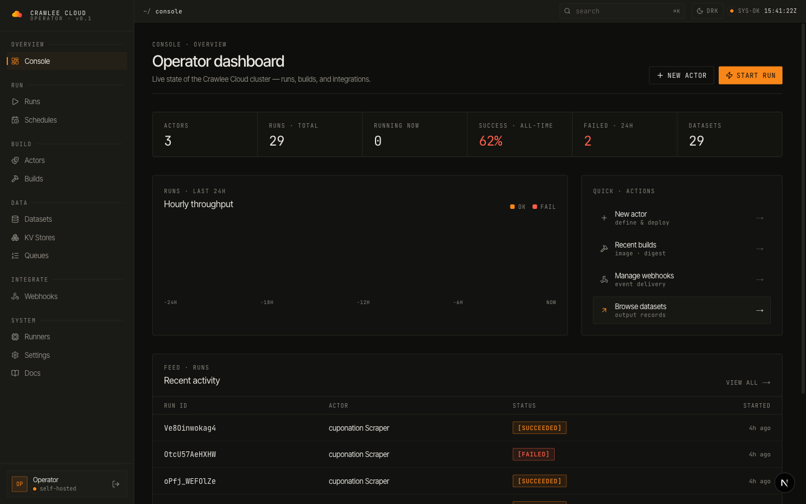
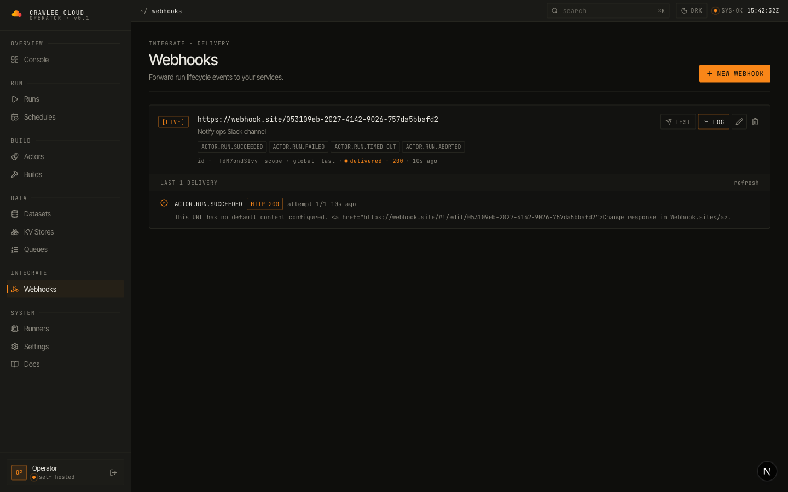
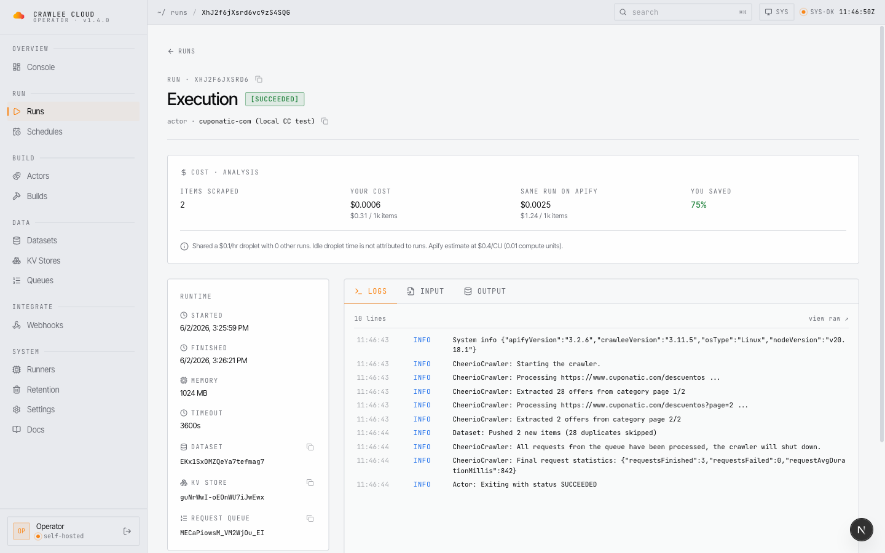
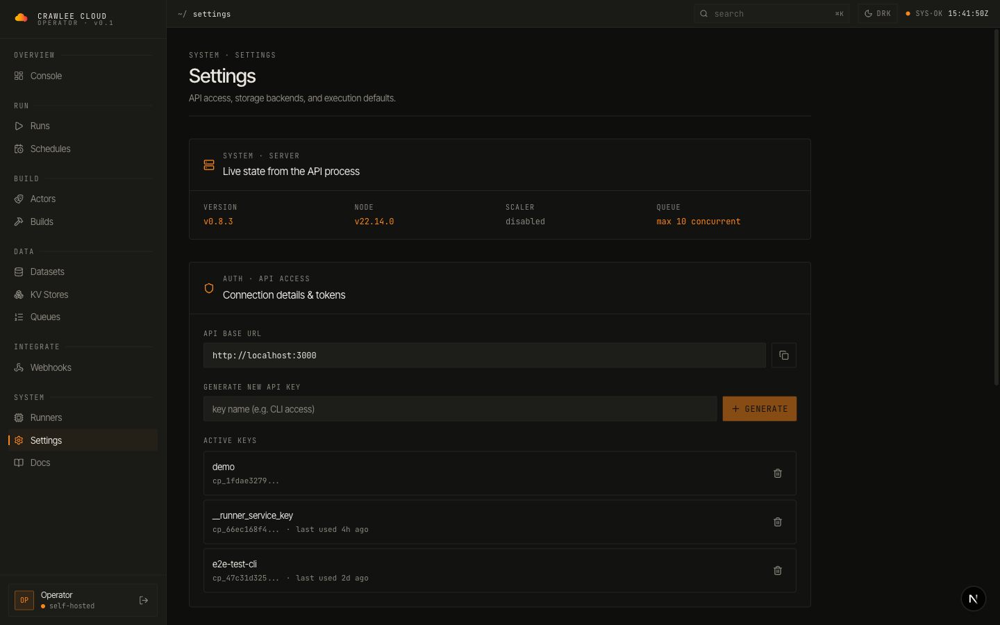
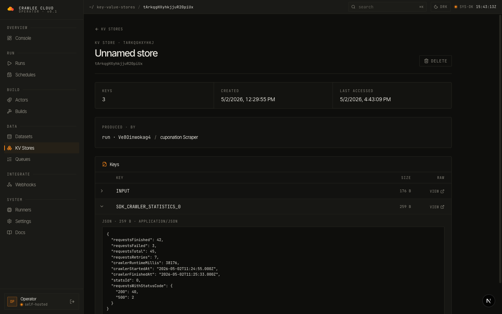
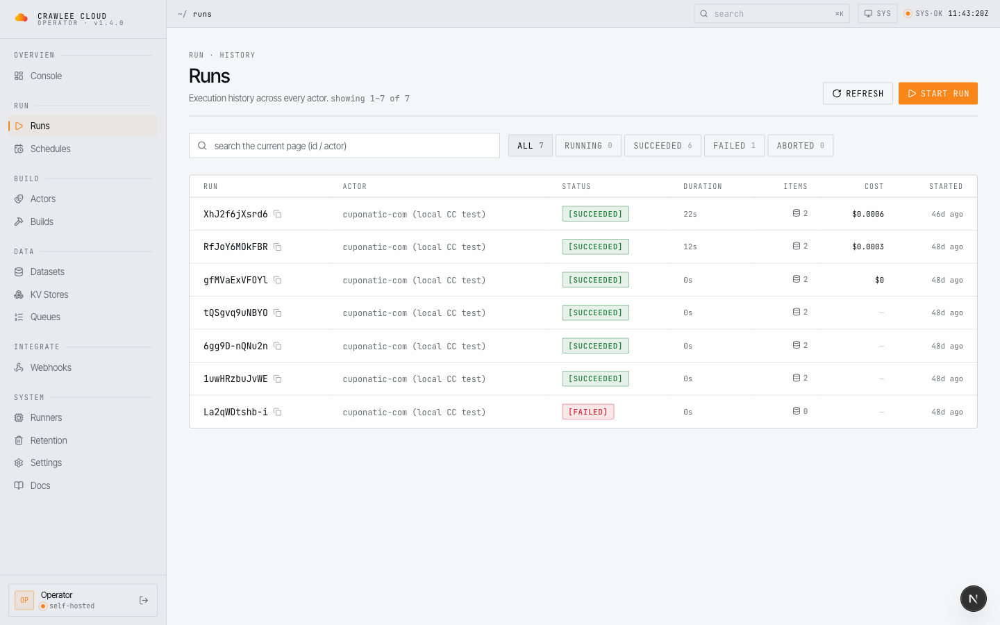
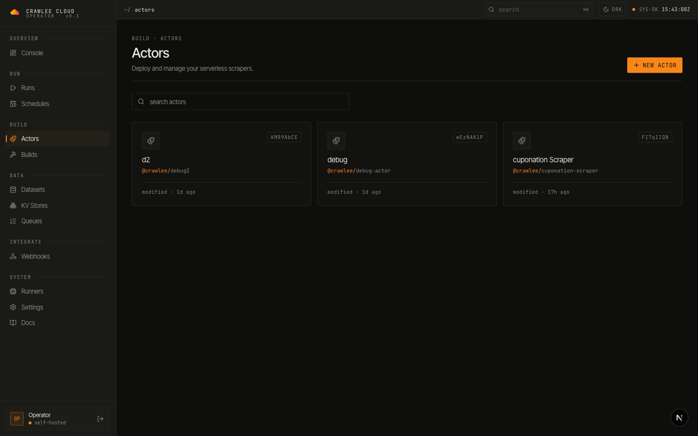

<div align="center">

  <picture>
    <source media="(prefers-color-scheme: dark)" srcset="./logo-dark.svg">
    <source media="(prefers-color-scheme: light)" srcset="./logo-light.svg">
    
  </picture>

**Self-hosted, open-source platform for running Apify Actors on your own infrastructure.**

[](LICENSE)
[](https://www.typescriptlang.org/)
[](https://nodejs.org/)

<a href="https://www.producthunt.com/products/crawlee-cloud?utm_source=badge-featured&utm_medium=badge&utm_campaign=badge-crawlee-cloud" target="_blank"></a>

[Dashboard](#dashboard) · [Quick Start](#quick-start) · [Documentation](#documentation) · [Contributing](#contributing)

</div>

---

## Dashboard

A purpose-built operator console — monitor runs in real time, debug webhook deliveries, browse datasets, and triage failures without leaving the page.

<p align="center">
  
  <br/>
  <em>Operator dashboard — actor count, runs, success rate, hourly throughput, recent activity feed</em>
</p>

<table>
<tr>
<td width="50%">

<p align="center"><em>Webhooks — fire test events per subscription, inline delivery log with HTTP code + body, last-seen status</em></p>
</td>
<td width="50%">

<p align="center"><em>Run detail — cost analysis vs Apify, live logs, container runtime, dataset / KV / queue IDs</em></p>
</td>
</tr>
<tr>
<td width="50%">

<p align="center"><em>Settings — live version, scaler state, storage health probes (PG / Redis / S3) with latency, API keys</em></p>
</td>
<td width="50%">

<p align="center"><em>KV stores — click any record to pretty-print its JSON inline, no new tab needed</em></p>
</td>
</tr>
<tr>
<td width="50%">

<p align="center"><em>Runs — full execution history with status filters, durations, dataset links, per-run cost</em></p>
</td>
<td width="50%">

<p align="center"><em>Actors — your deployed scrapers with version + last-modified at a glance</em></p>
</td>
</tr>
</table>

---

## Why Crawlee Cloud?

Love the Crawlee/Apify ecosystem but want the freedom to run things your way? Crawlee Cloud brings the same great developer experience to your own infrastructure. Keep using the tools you love — just host them wherever you want.

### Key Benefits

- **� Your infrastructure** — Deploy on your own servers, cloud, or anywhere you like
- **🔒 Complete privacy** — Your data stays exactly where you want it
- **⚡ SDK compatible** — Works seamlessly with the Apify SDK you already know
- **🐳 Container-based** — Each Actor runs in an isolated Docker container
- **📊 Beautiful dashboard** — Monitor runs, explore datasets, manage everything visually
- **💰 Cost transparency** — See what each run actually cost you vs what Apify would have charged, per run and at a glance across the runs list

---

## How It Works

```bash
# Instead of pointing to Apify's servers...
export APIFY_API_BASE_URL=https://api.apify.com/v2

# Point to your own Crawlee Cloud instance
export APIFY_API_BASE_URL=https://your-server.com/v2
export APIFY_TOKEN=your-token
```

Your existing Actor code works without any modifications:

```typescript
import { Actor } from 'apify';

await Actor.init();
await Actor.pushData({ title: 'Scraped data' });
await Actor.exit();
```

---

## Quick Start

### Prerequisites

- Node.js 18+
- Docker & Docker Compose
- PostgreSQL, Redis, and S3-compatible storage (or use our Docker setup)

### 1. Clone & Install

```bash
git clone https://github.com/crawlee-cloud/crawlee-cloud.git
cd crawlee-cloud
npm install
```

### 2. Start Infrastructure

```bash
# Starts PostgreSQL, Redis, and MinIO
npm run docker:dev
```

### 3. Configure Environment

```bash
cp .env.example .env
# Edit .env with your settings
```

### 4. Build & Run

```bash
npm run build
npm run db:migrate
npm run dev
```

The API server starts at `http://localhost:3000`.

---

## Deploy

Deploy your own instance in minutes:

| Method                                                                                                                                                                               | Status         | Description                                                            |
| ------------------------------------------------------------------------------------------------------------------------------------------------------------------------------------ | -------------- | ---------------------------------------------------------------------- |
| [](https://cloud.digitalocean.com/apps/new?repo=https://github.com/crawlee-cloud/crawlee-cloud/tree/main&refcode=crawlee) | ✅ Supported   | Automated full stack — App Platform, managed PG/Redis, Runner Droplet  |
| [VPS Deploy Script](deploy/vps/)                                                                                                                                                     | ✅ Supported   | Full stack on any Ubuntu VPS with auto-HTTPS via Caddy                 |
| Railway                                                                                                                                                                              | 🚧 Coming soon | One-click PaaS deploy (template scaffolding present, not yet verified) |
| Render                                                                                                                                                                               | 🚧 Coming soon | One-click PaaS deploy (blueprint present, not yet verified)            |

See [deploy/](deploy/) for detailed instructions.

---

## Architecture

```
┌─────────────────────────────────────────────────────────────────┐
│                        Your Actors                              │
│            (using official Apify SDK, no changes)               │
└────────────────────────────┬────────────────────────────────────┘
                             │
                             ▼
┌─────────────────────────────────────────────────────────────────┐
│                     Crawlee Cloud API                           │
│              (Apify-compatible REST endpoints)                  │
└─────────────────────────────────────────────────────────────────┘
        │                    │                    │
        ▼                    ▼                    ▼
   ┌──────────┐         ┌─────────┐         ┌─────────┐
   │PostgreSQL│         │  Redis  │         │ S3/MinIO│
   │ metadata │         │ queues  │         │  blobs  │
   └──────────┘         └─────────┘         └─────────┘
```

### Components

| Component      | Description                                                 |
| -------------- | ----------------------------------------------------------- |
| **API Server** | Fastify-based REST API compatible with Apify's v2 endpoints |
| **Runner**     | Polls job queue and executes Actors in Docker containers    |
| **Dashboard**  | Next.js web UI for monitoring and management                |
| **CLI**        | Command-line tool for pushing and running Actors            |

---

## Documentation

| Guide                                                                 | Description                  |
| --------------------------------------------------------------------- | ---------------------------- |
| [API Reference](https://crawlee.cloud/docs/api)                       | REST API endpoints and usage |
| [CLI Guide](https://crawlee.cloud/docs/cli)                           | Command-line interface       |
| [Dashboard](https://crawlee.cloud/docs/dashboard)                     | Web interface overview       |
| [Deployment](https://crawlee.cloud/docs/deployment)                   | Production deployment guide  |
| [Runner](https://crawlee.cloud/docs/runner)                           | Actor execution engine       |
| [SDK Compatibility](https://crawlee.cloud/docs/apify-sdk-environment) | Apify SDK integration        |

---

## Supported Apify SDK Features

| Feature                                      | Status       |
| -------------------------------------------- | ------------ |
| Datasets (`Actor.pushData`)                  | ✅ Supported |
| Key-Value Stores (`Actor.getValue/setValue`) | ✅ Supported |
| Request Queues                               | ✅ Supported |
| Request deduplication                        | ✅ Supported |
| Distributed locking                          | ✅ Supported |
| Builds & versioning                          | ✅ Supported |
| Webhooks                                     | ✅ Supported |
| Schedules                                    | ✅ Supported |
| Auto-scaling runners (local Docker, GHCR)    | ✅ Supported |

---

## What's New

**v1.4.0** — cost visibility everywhere. The runs list now shows what each finished run cost you at a glance, backed by a batch cost endpoint (`GET /v2/actor-runs/costs`) that answers a whole page in two queries; run details already carried the full breakdown — your cost via actual-overlap droplet attribution vs what the same run would cost on Apify, with savings %. See the [full changelog](CHANGELOG.md#140---2026-07-19).

The 1.1–1.3 line that led here covered: the zombie-run reliability overhaul from a live production incident — Redis-blip-proof dead-runner detection, a zombie-run reaper, OOM kills made visible, failed-run logs archived to KV, prebuilt runner images cutting ~4.5 min off scale-up (v1.1.x); memory-aware placement, fast dead-runner reap, and the claim-time cost-attribution stamps (v1.2.0); ingest hot-path performance and runner-key self-healing (v1.2.1/1.2.2); and the run-details cost analysis card (v1.3.0).

> **Upgrading from v1.3.x to v1.4.0** is a drop-in: no schema migration, no env-var changes, API + dashboard redeploy only. From v1.2.x, also note the optional `APIFY_CU_PRICE` (default `0.40`) added in 1.3.0. From v1.0.x or earlier, walk the [CHANGELOG](CHANGELOG.md) forward — deploy notes are flagged inline at each release.

---

## Contributing

We welcome contributions! Please see our [Contributing Guide](CONTRIBUTING.md) for details.

```bash
# Run tests
npm test

# Type checking
npm run typecheck

# Linting
npm run lint
```

---

## License

This project is licensed under the [MIT License](LICENSE).

---

<div align="center">

**Built with ❤️ for the web scraping community**

</div>
